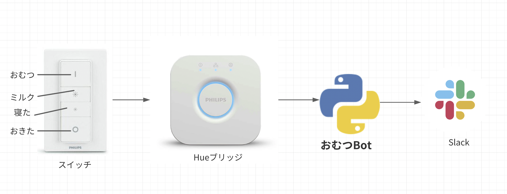

omutsu-bot
================
おむつの記録をSlackに送る

コンセプト
-----
- HueブリッジとスイッチのイベントをSlackに送る



コマンドライン
----
```bash
poetry install
poetry run python main.py {ブリッジのIP} {APPKEY} {センサーID} {SlackのWEBHOOK}
```
